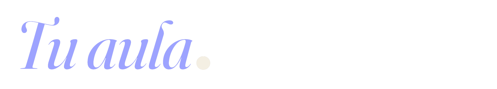

# Aula

**Plataforma de clases**

Un espacio para enseñar a tu manera. Cada clase con su propia <em>identidad visual</em>, su propia URL pública, y todo lo necesario para crear contenidos, programar evaluaciones y llevar las notas sin pelear con la tecnología.

---

## 01 · Qué es

Una plataforma web hecha para <em>un solo profesor</em>: tú. No es Moodle, no es Classroom. Es una herramienta enfocada que entiende que cada curso tuyo es distinto y merece su propia voz visual. Los estudiantes acceden por un enlace, sin registrarse, y solo se identifican cuando van a presentar una evaluación.

<ul>
  <li><strong>Una <em>URL pública</em> por clase</strong> 
  Compartes <code>app.com/c/historia-biblica</code> y listo. El estudiante navega sin cuenta.</li>

  <li><strong>Tú decides <em>cuándo se ve qué</em></strong> 
  Cada módulo y evaluación tiene su propio estado: borrador, programado, abierto, cerrado.</li>

  <li><strong>Las notas <em>viven contigo</em></strong> 
  Gradebook completo con categorías ponderadas, notas automáticas de quizzes y manuales para lo demás.</li>
</ul>

---

## 02 · Identidad por clase

Cuando creas una clase eliges <em>uno de ocho colores</em> de acento y un título. La plataforma compone una marca tipográfica única que viaja contigo: en la portada, en los mapas, en las notificaciones. Cuando el estudiante recuerde "la clase del color tierra", está recordando Geografía del Nuevo Testamento.

---

## 03 · Contenido

Cada clase se compone de <strong>módulos</strong> (hasta 16) y cada módulo contiene <strong>contenidos</strong>. Cinco tipos disponibles, mezclables en cualquier orden, arrastrables para reordenar.

<ul>
  <li><strong>Editor <em>estilo Notion</em></strong> 
  Escribes tu texto enriquecido (negritas, listas, citas, encabezados) con autoguardado cada pocos segundos. No pierdes el trabajo si se cae el internet.</li>

  <li><strong>Borrador <em>y publicado</em></strong> 
  Trabajas con calma en un borrador. Cuando estés listo, le das "Publicar cambios" y el estudiante ve la versión nueva. Lo que estás editando no se filtra antes de tiempo.</li>

  <li><strong>Mapas <em>con tu paleta</em></strong> 
  Los mapas de Mapbox usan un estilo personalizado alineado al lenguaje visual de tu clase. El pin sale en el color de acento que elegiste.</li>

  <li><strong>Vista previa <em>privada</em></strong> 
  Antes de publicar, ves exactamente lo que verá el estudiante. Funciona también para clases programadas que aún no han abierto.</li>
</ul>

---

## 04 · Disponibilidad

Cada módulo y cada evaluación tiene tres controles independientes: <em>publicado</em> (existe para el estudiante), <em>disponible</em> (interruptor maestro), y una <em>ventana de fechas</em> opcional con apertura y cierre. Esto te permite preparar todo el curso de antemano y dejar que los módulos se desbloqueen solos cada semana.

<ul>
  <li><strong>Secuencia <em>semanal automática</em></strong> 
  Defines que el módulo 3 abre el lunes 20 a las 7 a.m. y el sistema lo desbloquea solo. El estudiante ve un candado con la fecha hasta entonces, lo que genera anticipación.</li>

  <li><strong>Indicadores <em>visibles</em></strong> 
  En tu dashboard, cada módulo carga un ícono que delata su estado de un vistazo: check verde (abierto), reloj ámbar (programado), candado (cerrado), lápiz (borrador).</li>

  <li><strong>Gracia <em>al cerrar</em></strong> 
  Si un estudiante está presentando un quiz cuando llega la hora de cierre, tiene 15 minutos extra para terminar. No se penaliza por la hora exacta.</li>
</ul>

---

## 05 · Evaluaciones

Cinco tipos de pregunta, configuración fina por cada quiz, calificación automática para lo automático y revisión manual cuando hace falta.

<ul>
  <li><strong>Pin en el mapa: <em>algo único</em></strong> 
  Preguntas como "marca dónde queda el Monte Sinaí" se evalúan automáticamente con una tolerancia en kilómetros que tú defines. Perfecto para historia y geografía.</li>

  <li><strong>Tiempo <em>opcional</em></strong> 
  De 1 a 180 minutos, o sin límite. El reloj corre del lado del servidor, así que cerrar el navegador no para el cronómetro.</li>

  <li><strong>Intentos <em>flexibles</em></strong> 
  Hasta 5 intentos por estudiante. Tú decides si cuenta el mejor o el promedio.</li>

  <li><strong>Auto-calificación <em>+ revisión</em></strong> 
  Las preguntas de opción se califican solas. Las de respuesta abierta entran a una cola donde tú asignas puntos y feedback. Las notas aterrizan automáticamente en el gradebook.</li>

  <li><strong>Anti-trampa <em>discreto</em></strong> 
  Solo un quiz abierto a la vez. Si el estudiante cambia de pestaña o pega contenido, se registra como actividad (no como acusación). Tú decides cómo interpretarlo al revisar.</li>

  <li><strong>Cuándo <em>se ven las respuestas</em></strong> 
  Eliges si el estudiante ve las correctas: nunca, justo al enviar, o solo después de que cierre la ventana del quiz.</li>

  <li><strong>Memoria <em>fiel del intento</em></strong> 
  Si editas una pregunta después de que un estudiante la respondió, el intento conserva exactamente lo que vio él, no la versión nueva. Auditoría académica respetada.</li>
</ul>

---

## 06 · Estudiantes

El estudiante no se registra con contraseña. Solo necesita su correo. Para quizzes que cuentan para nota, además se verifica con un <em>código de 6 dígitos</em> enviado al correo, para garantizar que es quien dice ser.

<ul>
  <li><strong>Identificación <em>en un minuto</em></strong> 
  El estudiante escribe nombre, apellido y correo. Recibe un código por email. Lo ingresa. Listo.</li>

  <li><strong>Dispositivos <em>compartidos</em></strong> 
  En el header del quiz siempre se ve el correo activo con un botón "No soy yo / cambiar correo". Ideal cuando dos estudiantes usan la misma tablet de la casa.</li>

  <li><strong>Roster <em>por clase</em></strong> 
  Cada clase tiene su lista de estudiantes inscritos. Puedes asignarles un nombre amigable que solo tú ves y agregar notas internas.</li>
</ul>

---

## 07 · Gradebook

Un libro de calificaciones serio: categorías con peso, notas automáticas desde los quizzes, notas manuales para los trabajos, historial de cambios y exportación a CSV cuando lo necesites.

<ul>
  <li><strong>Categorías <em>ponderadas</em></strong> 
  Defines tus categorías y su peso (ej: Quizzes 40%, Trabajos 40%, Participación 20%). El sistema valida que sumen 100%.</li>

  <li><strong>Auto + manual</strong> 
  Los quizzes alimentan el gradebook solos. Para trabajos, participación o cualquier nota a mano, agregas un item manual y escribes el puntaje.</li>

  <li><strong>Items <em>sin entregar</em></strong> 
  Tú decides la política: cuenta como cero cuando cierre la fecha, cuenta cero inmediatamente, o se ignora siempre. Una decisión por item.</li>

  <li><strong>Historial <em>de cambios</em></strong> 
  Si ajustas una nota a mano, queda registrado el puntaje anterior, el nuevo, la razón que escribiste y la fecha. Útil si un estudiante reclama.</li>

  <li><strong>Exportación <em>a CSV</em></strong> 
  Un botón y descargas el libro completo para imprimirlo, subirlo al sistema del colegio, o lo que necesites.</li>
</ul>

---

## 08 · Notificaciones

Sin spam. Notificaciones puntuales que te dicen qué necesita tu atención y mantienen al estudiante informado.

<ul>
  <li><strong>Para ti, <em>en el dashboard</em></strong> 
  Centro de notificaciones con una campana arriba. Te avisa cuando un estudiante envía un quiz, cuando hay intentos esperando revisión manual, cuándo se acerca un cierre, qué módulo abre hoy.</li>

  <li><strong>Para el estudiante, <em>por correo</em></strong> 
  Recibe confirmación cuando envía un intento y otra cuando tú calificas. Plantillas sobrias, sin marketing, en español.</li>
</ul>

---

## 09 · En cualquier dispositivo

Tu dashboard funciona en computador, tablet y móvil. La landing pública también. Probado para que tus estudiantes puedan presentar un quiz desde el bus o desde el computador del colegio, indistintamente.

<ul>
  <li><strong>Responsive <em>de verdad</em></strong> 
  No es la versión móvil castigada. Cada pantalla se rediseña para el tamaño: en móvil el editor pasa a una vista vertical, el gradebook se vuelve tarjetas, los menús laterales se vuelven hojas que suben desde abajo.</li>

  <li><strong>Accesible <em>(WCAG AA)</em></strong> 
  Contraste correcto, navegación con teclado, lectores de pantalla considerados, tamaños de toque grandes. Cumple estándar internacional de accesibilidad.</li>

  <li><strong>Aguanta <em>desconexiones</em></strong> 
  Si el internet del estudiante se cae a mitad de un quiz, sus respuestas se guardan localmente y se sincronizan al volver. El reloj sigue corriendo, pero no pierde el trabajo.</li>
</ul>

---

## 10 · Tras bambalinas

Cosas que no se ven pero que importan: tus datos están respaldados, los del estudiante están protegidos, los errores se monitorean, y nada se pierde por accidente.

<ul>
  <li><strong>Respaldos <em>automáticos</em></strong> 
  La base de datos se respalda automáticamente todos los días. Se puede recuperar a cualquier minuto de los últimos 7 días si algo sale mal. Backups adicionales semanales.</li>

  <li><strong>Papelera <em>de 30 días</em></strong> 
  Si borras una clase, módulo o contenido por error, queda en una sección de archivo recuperable durante 30 días.</li>

  <li><strong>Privacidad <em>respetada</em></strong> 
  No usamos analítica de terceros. Los estudiantes pueden solicitar la eliminación de sus datos. La plataforma no se indexa en Google.</li>

  <li><strong>Panel <em>de admin</em></strong> 
  Una sección extra solo para ti con métricas del sistema: cuántos estudiantes activos, quizzes con más intentos, preguntas que más fallan, eventos del anti-trampa.</li>
</ul>

---
